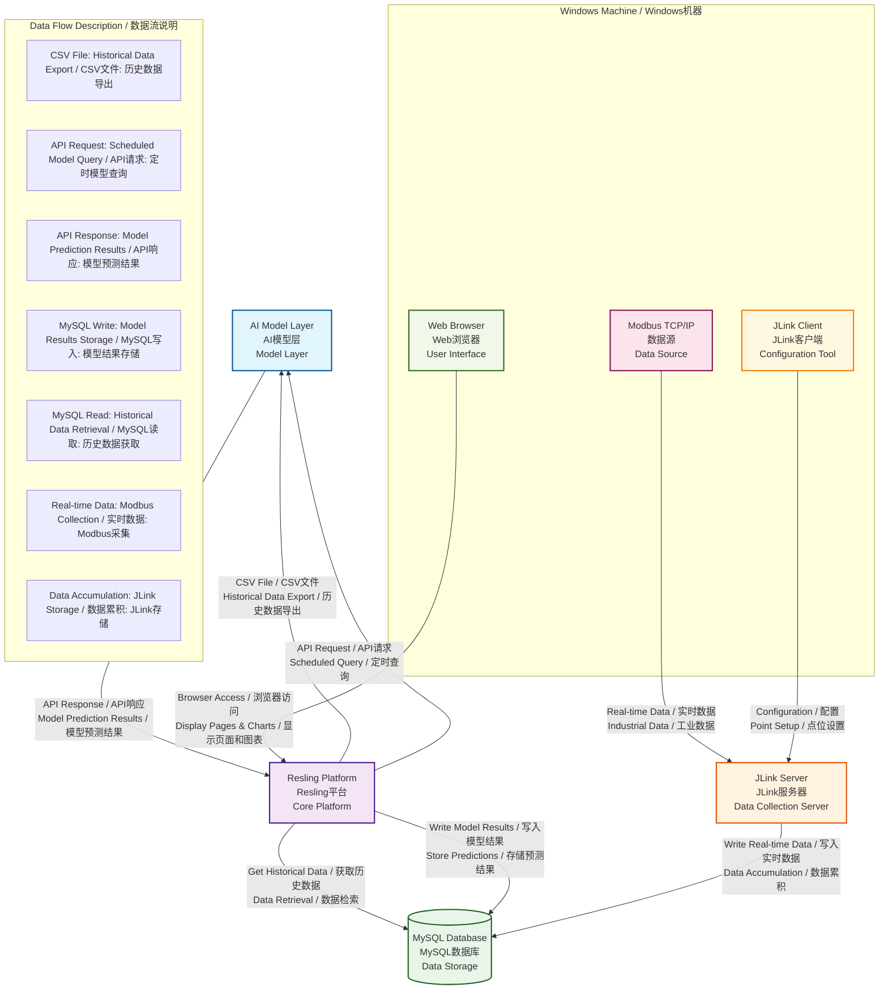

# Resling Platform Requirements v0.1 - Resling平台需求文档 v0.1

## Document Information - 文档信息
- **Version:** v0.1
- **Date:** 2025-08-24
- **Status:** Draft / 草稿
- **Purpose:** Vendor Assessment / 厂家评估
- **Author:** Project Team / 项目团队

---

## 2. System Overview - 系统概览

### 2.1 System Architecture Diagram - 系统架构图



### 2.2 Architecture Components Description - 架构组件说明

#### 2.2.1 Resling Platform (核心平台)
- **Position / 位置**: System center, serving as data flow and processing center / 系统中央，作为数据流转和处理中心
- **Main Functions / 主要功能**: 
  - Data format conversion (MySQL → CSV) / 数据格式转换 (MySQL → CSV)
  - API communication management (interaction with AI model) / API通信管理 (与AI模型交互)
  - Result data processing and storage / 结果数据处理和存储
  - Web service provision (frontend access) / Web服务提供 (前端访问)

#### 2.2.2 AI Model Layer (AI模型层)
- **Position / 位置**: Above Resling platform / Resling平台上方
- **Interaction Methods / 交互方式**:
  - Receive CSV format historical data files / 接收CSV格式的历史数据文件
  - Receive scheduled query requests via API / 通过API接收定时查询请求
  - Return prediction results via API / 通过API返回预测结果

#### 2.2.3 MySQL Database (数据库)
- **Position / 位置**: Left side of Resling platform / Resling平台左侧
- **Functions / 功能**:
  - Store historical operation data / 存储历史运行数据
  - Store model prediction results / 存储模型预测结果
  - Support data query and retrieval / 支持数据查询和检索

#### 2.2.4 JLink Server (数据采集服务器)
- **Position / 位置**: Below Resling platform / Resling平台下方
- **Functions / 功能**:
  - Collect real-time data from Modbus TCP/IP data source / 从Modbus TCP/IP数据源采集实时数据
  - Write collected data to MySQL database / 将采集数据写入MySQL数据库
  - Read model result tables to obtain control instructions / 读取模型结果表，获取控制指令

#### 2.2.5 Modbus TCP/IP Data Source (数据源)
- **Position / 位置**: Below JLink server / JLink服务器下方
- **Functions / 功能**:
  - Generate real-time industrial field data / 产生工业现场实时数据
  - Provide data interface through Modbus protocol / 通过Modbus协议提供数据接口

#### 2.2.6 Windows Frontend (前端界面)
- **Position / 位置**: Right side of Resling platform / Resling平台右侧
- **Three Major Functions / 三大功能**:
  1. **Web Browser Access / Web浏览器访问**: Display Resling platform pages and charts / 显示Resling平台的页面和图表
  2. **Data Source Installation / 数据源安装**: Modbus TCP/IP data source runtime environment / Modbus TCP/IP数据源运行环境
  3. **JLink Client / JLink客户端**: Configure JLink collection points / 配置JLink采集点位

### 2.3 Data Flow Description - 数据流说明

#### 2.3.1 Historical Data Flow - 历史数据流
```
MySQL Database → Resling Platform → CSV File → AI Model
MySQL数据库 → Resling平台 → CSV文件 → AI模型
```

#### 2.3.2 Real-time Data Flow - 实时数据流
```
Modbus Data Source → JLink Server → MySQL Database → Resling Platform
Modbus数据源 → JLink服务器 → MySQL数据库 → Resling平台
```

#### 2.3.3 Model Interaction Flow - 模型交互流
```
Resling Platform → API Request → AI Model → API Response → Resling Platform → MySQL Database
Resling平台 → API请求 → AI模型 → API响应 → Resling平台 → MySQL数据库
```

#### 2.3.4 Control Instruction Flow - 控制指令流
```
MySQL Database → JLink Server → Industrial Equipment
MySQL数据库 → JLink服务器 → 工业设备
```

#### 2.3.5 User Interface Flow - 用户界面流
```
Windows Frontend → Browser → Resling Platform → Data Display
Windows前端 → 浏览器 → Resling平台 → 数据展示
```

### 2.4 API Interface Specifications - API接口规范

#### 2.4.1 AI Model API Endpoints - AI模型API端点

**Base URL:** `http://localhost:8000`

##### 2.4.1.1 Temperature Optimization Endpoint - 温度优化接口
- **Endpoint:** `/optimize_temperature`
- **Method:** POST
- **Content-Type:** application/json
- **Request Parameters / 请求参数:**
  ```json
  {
    "filename": "data_2025-01-01_12-00-00.csv",
    "running_mode": "separated|all_together",
    "operation_intensity": "low"
  }
  ```
- **Response Format / 响应格式:**
  ```json
  {
    "temperature": {
      "network_1": 11.8,
      "network_2": 11.8,
      "network_3": 7.0,
      "combined": 10.2
    },
    "device_status": [
      {
        "name": "chiller1",
        "is_active": true
      },
      {
        "name": "pump1",
        "is_active": true
      }
    ],
    "pump_allocation": {
      "ratios": {
        "network_1": {
          "pump1": 0.6,
          "pump2": 0.4
        }
      },
      "base_frequency": {
        "network_1": 40.0,
        "network_2": 40.0,
        "network_3": 40.0
      }
    }
  }
  ```

##### 2.4.1.2 Alarm Information Endpoint - 报警信息接口
- **Endpoint:** `/alarm_info`
- **Method:** POST
- **Content-Type:** application/json
- **Request Parameters / 请求参数:** All fields of AlarmTable entity object / AlarmTable实体对象的所有字段
- **Response Format / 响应格式:** Returns corresponding processing results based on specific alarm types / 根据具体报警类型返回相应处理结果

#### 2.4.2 CSV Data Format - CSV数据格式

**CSV file contains the following fields (210 fields) / CSV文件包含以下字段（210个字段）:**
- `startdatetime` - Timestamp / 时间戳
- `hvac_chiller_1_1` - 1# Chiller chilled water outlet temperature / 1#空调冷冻机组冷冻水出水温度
- `hvac_chiller_1_2` - 1# Chiller cooling water inlet temperature / 1#空调冷冻机组冷却水进水温度
- `hvac_chiller_1_30` - 1# Chiller instantaneous flow rate / 1#空调冷冻机组瞬时流量
- `hvac_chiller_1_33` - 1# Chiller PM meter active power / 1#空调主机PM表有功功率
- `hvac_chiller_1_40` - 1# Chiller cooling capacity meter instantaneous cooling capacity / 1#空调主机冷量计瞬时冷量
- `hvac_chiller_1_43` - 1# Chiller cooling capacity meter instantaneous flow rate / 1#空调主机冷量计瞬时流量
- `hvac_chiller_1_60` - 1# Chiller 1# chilled water pump output power / 1#空调冷冻机组1#冷冻泵输出功率
- `hvac_chiller_1_62` - 1# Chiller 1# chilled water pump frequency / 1#空调冷冻机组1#冷冻泵频率
- `hvac_chiller_1_65` - 1# Chiller 2# chilled water pump output power / 1#空调冷冻机组2#冷冻泵输出功率
- `hvac_chiller_1_67` - 1# Chiller 2# chilled water pump frequency / 1#空调冷冻机组2#冷冻泵频率
- ... (Other chiller and pump related fields / 其他主机和水泵相关字段)
- `hvac_hua_*` - Air handling unit related fields (temperature, humidity, cooling capacity, flow rate, etc.) / 风柜相关字段（温度、湿度、冷量、流量等）

### 2.5 Database Table Specifications - 数据库表规范

#### 2.5.1 Input Data Tables - 输入数据表

##### 2.5.1.1 java_input_table
- **Purpose / 用途:** Store real-time data collected from JLink server / 存储从JLink服务器采集的实时数据
- **Main Fields / 主要字段:** Contains real-time operation data of all HVAC equipment (210 fields) / 包含所有HVAC设备的实时运行数据（210个字段）
- **Data Source / 数据来源:** JLink server collects from Modbus TCP/IP data source / JLink服务器从Modbus TCP/IP数据源采集

##### 2.5.1.2 alarm_table
- **Purpose / 用途:** Store system alarm information / 存储系统报警信息
- **Main Fields / 主要字段:** 
  - `startdatetime` - Alarm time / 报警时间
  - `ALL_NETWORK_MERGECMD_0` - Network merge command / 网络合并命令
  - Various air handling unit alarm status fields / 各种风柜的报警状态字段

##### 2.5.1.3 chiller_rank_table
- **Purpose / 用途:** Store chiller ranking information / 存储主机排序信息
- **Main Fields / 主要字段:**
  - `startdatetime` - Timestamp / 时间戳
  - `chiller_rank_1` to `chiller_rank_9` - Chiller rankings 1 to 9 / 各主机排序

##### 2.5.1.4 intouch_faultcode_table
- **Purpose / 用途:** Store chiller fault codes / 存储主机故障代码
- **Main Fields / 主要字段:**
  - `startdatetime` - Timestamp / 时间戳
  - `chiller_faultcode` - Fault code (decimal) / 故障代码（十进制）

#### 2.5.2 Output Data Tables - 输出数据表

##### 2.5.2.1 java_output_table
- **Purpose / 用途:** Store AI model optimization results / 存储AI模型优化结果
- **Main Fields / 主要字段:**
  - `datetime` - Timestamp / 时间戳
  - `network_1`, `network_2`, `network_3`, `combined` - Network temperatures / 网络温度
  - `deviceStatusChiller*IsAct` - Chiller status / 主机状态
  - `deviceStatusPump*IsAct` - Pump status / 水泵状态
  - `pumpAllocationRatiosPump*` - Pump allocation ratios / 水泵分配比例
  - `baseFrequencyNetwork*` - Base frequency / 基础频率
  - `runningMode` - Running mode / 运行模式
  - `operationIntensity` - Operation intensity / 运行强度

##### 2.5.2.2 java_output_temporary_table
- **Purpose / 用途:** Store temporary optimization results / 存储临时优化结果
- **Fields / 字段:** Same as java_output_table, with additional `next` field / 与java_output_table相同，增加`next`字段

##### 2.5.2.3 java_schedule_param
- **Purpose / 用途:** Store scheduling parameters / 存储调度参数
- **Main Fields / 主要字段:**
  - `id` - Primary key / 主键
  - `name` - Parameter name / 参数名
  - `value` - Parameter value / 参数值

### 2.6 Database Connection Configuration - 数据库连接配置

#### 2.6.1 MySQL Database Settings - MySQL数据库设置

**Database Configuration / 数据库配置:**
```yaml
spring:
  datasource:
    url: jdbc:mysql://localhost:3306/bjkt?useUnicode=true&characterEncoding=utf-8&useSSL=false&serverTimezone=UTC
    driver-class-name: com.mysql.cj.jdbc.Driver
    username: root
    password: root
```

**Database Name / 数据库名称:** `bjkt`

**Connection Pool / 连接池:**
- **Driver:** MySQL Connector/J 8.0.32
- **Encoding:** UTF-8
- **SSL:** Disabled
- **Timezone:** UTC

#### 2.6.2 MyBatis-Plus Configuration - MyBatis-Plus配置

```yaml
mybatis-plus:
  mapper-locations: classpath*:mapper/*.xml
  type-aliases-package: com.bj.bjkt.entity
  configuration:
    map-underscore-to-camel-case: true
    log-impl: org.apache.ibatis.logging.stdout.StdOutImpl
```

**Features / 特性:**
- **Mapper XML Location / Mapper XML位置:** `classpath*:mapper/*.xml`
- **Entity Package / 实体包:** `com.bj.bjkt.entity`
- **Camel Case Mapping / 驼峰命名映射:** Enabled
- **SQL Logging / SQL日志:** Enabled

#### 2.6.3 Database Table Mapping - 数据库表映射

**Complete Table List / 完整表列表:**

| Table Name / 表名 | Entity Class / 实体类 | Purpose / 用途 | Fields / 字段数 |
|------------------|---------------------|---------------|----------------|
| `java_input_table` | `JavaInputTable` | Real-time Data Storage / 实时数据存储 | 210 |
| `java_output_table` | `JavaOutputTable` | AI Model Optimization Results / AI模型优化结果 | 35+ |
| `java_output_temporary_table` | `JavaOutputTemporaryTable` | Temporary Optimization Results / 临时优化结果 | 35+ |
| `java_schedule_param` | `JavaScheduleParam` | Schedule Parameters Storage / 调度参数存储 | 3 |
| `alarm_table` | `AlarmTable` | Alarm Information Storage / 报警信息存储 | 50+ |
| `chiller_rank_table` | `ChillerRankTable` | Chiller Ranking Information / 主机排序信息 | 9 |
| `intouch_faultcode_table` | `IntouchFaultcodeTable` | Fault Code Storage / 故障代码存储 | 2 |

**Table Relationships / 表关系:**

1. **Data Flow Tables / 数据流表:**
   - `java_input_table` → `java_output_table` (Real-time data → Optimization results / 实时数据 → 优化结果)
   - `java_output_table` → `java_output_temporary_table` (Optimization results → Temporary storage / 优化结果 → 临时存储)

2. **Control Tables / 控制表:**
   - `java_schedule_param` (Schedule parameter control / 调度参数控制)
   - `alarm_table` (Alarm control / 报警控制)
   - `chiller_rank_table` (Chiller ranking control / 主机排序控制)
   - `intouch_faultcode_table` (Fault control / 故障控制)

**Key Operations / 关键操作:**

1. **Data Retrieval / 数据检索:**
   ```java
   // Get historical data for CSV generation / 获取历史数据用于CSV生成
   List<JavaInputTable> list = javaInputTableService.list(wrapper);
   
   // Get latest alarm information / 获取最新报警信息
   AlarmTable alarmTable = alarmTableService.getOne(wrapper);
   ```

2. **Data Storage / 数据存储:**
   ```java
   // Save AI model optimization results / 保存AI模型优化结果
   javaOutputTableService.save(javaOutputTable);
   
   // Save temporary optimization results / 保存临时优化结果
   javaOutputTemporaryTableService.save(javaOutputTemporaryTable);
   ```

3. **Control Logic / 控制逻辑:**
   ```java
   // Get scheduling parameters / 获取调度参数
   JavaScheduleParam cron = javaScheduleParamService.getOne(wrapper);
   
   // Get chiller ranking information / 获取主机排序信息
   ChillerRankTable chillerRankTable = chillerRankTableService.getOne(queryWrapper);
   
   // Get fault codes / 获取故障代码
   IntouchFaultcodeTable faultcodeTable = intouchFaultTableService.getOne(faultQueryWrap);
   ```

**Resling Platform Integration / Resling平台集成:**

Resling platform needs to implement the following database operation functions / Resling平台需要实现以下数据库操作功能：

1. **Data Export / 数据导出:**
   - Read historical data from `java_input_table` / 从 `java_input_table` 读取历史数据
   - Generate CSV file format / 生成CSV文件格式
   - Support time range queries / 支持时间范围查询

2. **Model Results Storage / 模型结果存储:**
   - Receive AI model API responses / 接收AI模型API响应
   - Parse JSON data / 解析JSON数据
   - Store to `java_output_table` and `java_output_temporary_table` / 存储到 `java_output_table` 和 `java_output_temporary_table`

3. **Control Parameter Management / 控制参数管理:**
   - Read `java_schedule_param` to get scheduling configuration / 读取 `java_schedule_param` 获取调度配置
   - Read `alarm_table` to get alarm status / 读取 `alarm_table` 获取报警状态
   - Read `chiller_rank_table` to get chiller ranking / 读取 `chiller_rank_table` 获取主机排序
   - Read `intouch_faultcode_table` to get fault information / 读取 `intouch_faultcode_table` 获取故障信息

4. **Real-time Data Processing / 实时数据处理:**
   - Monitor new data in `java_input_table` / 监控 `java_input_table` 的新数据
   - Trigger AI model calls / 触发AI模型调用
   - Update control parameters / 更新控制参数