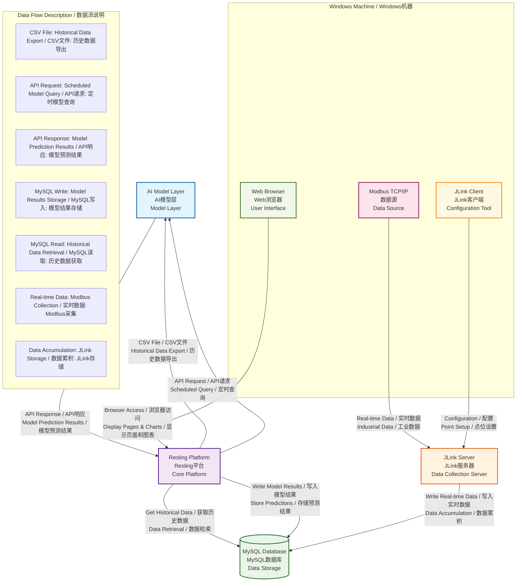

# Resling Platform Requirements - Resling平台需求文档

# Resling平台需求文档

## Document Information - 文档信息
- **Version:** v0.1
- **Date:** 2025-08-24
- **Status:** Draft / 草稿
- **Author:** Project Team / 项目团队

---

## Table of Contents - 目录

### 1. Executive Summary - 执行摘要
- [ ] Project Background / 项目背景
- [ ] Business Objectives / 业务目标
- [ ] Success Criteria / 成功标准

### 2. System Overview - 系统概览
- [ ] System Architecture Diagram / 系统架构图
- [ ] Architecture Components Description / 架构组件说明
- [ ] Data Flow Description / 数据流说明
- [ ] API Interface Specifications / API接口规范
- [ ] Database Table Specifications / 数据库表规范
- [ ] Database Connection Configuration / 数据库连接配置

### 3. Functional Requirements - 功能需求
- [ ] Core Functions / 核心功能
- [ ] User Interface Requirements / 用户界面需求
- [ ] Data Integration Requirements / 数据集成需求
- [ ] Control Logic Requirements / 控制逻辑需求

### 4. Technical Requirements - 技术需求
- [ ] Platform Requirements / 平台需求
- [ ] Development Requirements / 开发需求
- [ ] Integration Requirements / 集成需求
- [ ] Performance Requirements / 性能需求

### 5. Implementation Requirements - 实施需求
- [ ] Development Phases / 开发阶段
- [ ] Testing Requirements / 测试需求
- [ ] Deployment Requirements / 部署需求
- [ ] Documentation Requirements / 文档需求

### 6. Risk Assessment - 风险评估
- [ ] Technical Risks / 技术风险
- [ ] Schedule Risks / 进度风险
- [ ] Resource Risks / 资源风险
- [ ] Mitigation Strategies / 缓解策略

#### 2.1 System Architecture Diagram - 系统架构图



#### 2.2 Architecture Components Description - 架构组件说明

##### 2.2.1 Resling Platform (核心平台)
- **位置**: 系统中央，作为数据流转和处理中心
- **主要功能**: 
  - 数据格式转换 (MySQL → CSV)
  - API通信管理 (与AI模型交互)
  - 结果数据处理和存储
  - Web服务提供 (前端访问)

##### 2.2.2 AI Model Layer (AI模型层)
- **位置**: Resling平台上方
- **交互方式**:
  - 接收CSV格式的历史数据文件
  - 通过API接收定时查询请求
  - 通过API返回预测结果

##### 2.2.3 MySQL Database (数据库)
- **位置**: Resling平台左侧
- **功能**:
  - 存储历史运行数据
  - 存储模型预测结果
  - 支持数据查询和检索

##### 2.2.4 JLink Server (数据采集服务器)
- **位置**: Resling平台下方
- **功能**:
  - 从Modbus TCP/IP数据源采集实时数据
  - 将采集数据写入MySQL数据库
  - 读取模型结果表，获取控制指令

##### 2.2.5 Modbus TCP/IP Data Source (数据源)
- **位置**: JLink服务器下方
- **功能**:
  - 产生工业现场实时数据
  - 通过Modbus协议提供数据接口

##### 2.2.6 Windows Frontend (前端界面)
- **位置**: Resling平台右侧
- **三大功能**:
  1. **Web浏览器访问**: 显示Resling平台的页面和图表
  2. **数据源安装**: Modbus TCP/IP数据源运行环境
  3. **JLink客户端**: 配置JLink采集点位

#### 2.3 Data Flow Description - 数据流说明

##### 2.3.1 历史数据流
```
MySQL数据库 → Resling平台 → CSV文件 → AI模型
```

##### 2.3.2 实时数据流
```
Modbus数据源 → JLink服务器 → MySQL数据库 → Resling平台
```

##### 2.3.3 模型交互流
```
Resling平台 → API请求 → AI模型 → API响应 → Resling平台 → MySQL数据库
```

##### 2.3.4 控制指令流
```
MySQL数据库 → JLink服务器 → 工业设备
```

##### 2.3.5 用户界面流
```
Windows前端 → 浏览器 → Resling平台 → 数据展示
```

#### 2.4 API Interface Specifications - API接口规范

##### 2.4.1 AI Model API Endpoints - AI模型API端点

**Base URL:** `http://localhost:8000`

###### 2.4.1.1 温度优化接口 - Temperature Optimization Endpoint
- **Endpoint:** `/optimize_temperature`
- **Method:** POST
- **Content-Type:** application/json
- **Request Parameters / 请求参数:**
  ```json
  {
    "filename": "data_2025-01-01_12-00-00.csv",
    "running_mode": "separated|all_together",
    "operation_intensity": "low"
  }
  ```
- **Response Format / 响应格式:**
  ```json
  {
    "temperature": {
      "network_1": 11.8,
      "network_2": 11.8,
      "network_3": 7.0,
      "combined": 10.2
    },
    "device_status": [
      {
        "name": "chiller1",
        "is_active": true
      },
      {
        "name": "pump1",
        "is_active": true
      }
    ],
    "pump_allocation": {
      "ratios": {
        "network_1": {
          "pump1": 0.6,
          "pump2": 0.4
        }
      },
      "base_frequency": {
        "network_1": 40.0,
        "network_2": 40.0,
        "network_3": 40.0
      }
    }
  }
  ```

###### 2.4.1.2 报警信息接口 - Alarm Information Endpoint
- **Endpoint:** `/alarm_info`
- **Method:** POST
- **Content-Type:** application/json
- **Request Parameters / 请求参数:** AlarmTable实体对象的所有字段 / All fields of AlarmTable entity object
- **Response Format / 响应格式:** 根据具体报警类型返回相应处理结果 / Returns corresponding processing results based on specific alarm types

##### 2.4.2 CSV Data Format - CSV数据格式

**CSV文件包含以下字段（210个字段）/ CSV file contains the following fields (210 fields):**
- `startdatetime` - 时间戳 / Timestamp
- `hvac_chiller_1_1` - 1#空调冷冻机组冷冻水出水温度 / 1# Chiller chilled water outlet temperature
- `hvac_chiller_1_2` - 1#空调冷冻机组冷却水进水温度 / 1# Chiller cooling water inlet temperature
- `hvac_chiller_1_30` - 1#空调冷冻机组瞬时流量 / 1# Chiller instantaneous flow rate
- `hvac_chiller_1_33` - 1#空调主机PM表有功功率 / 1# Chiller PM meter active power
- `hvac_chiller_1_40` - 1#空调主机冷量计瞬时冷量 / 1# Chiller cooling capacity meter instantaneous cooling capacity
- `hvac_chiller_1_43` - 1#空调主机冷量计瞬时流量 / 1# Chiller cooling capacity meter instantaneous flow rate
- `hvac_chiller_1_60` - 1#空调冷冻机组1#冷冻泵输出功率 / 1# Chiller 1# chilled water pump output power
- `hvac_chiller_1_62` - 1#空调冷冻机组1#冷冻泵频率 / 1# Chiller 1# chilled water pump frequency
- `hvac_chiller_1_65` - 1#空调冷冻机组2#冷冻泵输出功率 / 1# Chiller 2# chilled water pump output power
- `hvac_chiller_1_67` - 1#空调冷冻机组2#冷冻泵频率 / 1# Chiller 2# chilled water pump frequency
- ... (其他主机和水泵相关字段 / Other chiller and pump related fields)
- `hvac_hua_*` - 风柜相关字段（温度、湿度、冷量、流量等）/ Air handling unit related fields (temperature, humidity, cooling capacity, flow rate, etc.)

#### 2.5 Database Table Specifications - 数据库表规范

##### 2.5.1 输入数据表 - Input Data Tables

###### 2.5.1.1 java_input_table
- **用途 / Purpose:** 存储从JLink服务器采集的实时数据 / Store real-time data collected from JLink server
- **主要字段 / Main Fields:** 包含所有HVAC设备的实时运行数据（210个字段）/ Contains real-time operation data of all HVAC equipment (210 fields)
- **数据来源 / Data Source:** JLink服务器从Modbus TCP/IP数据源采集 / JLink server collects from Modbus TCP/IP data source

###### 2.5.1.2 alarm_table
- **用途 / Purpose:** 存储系统报警信息 / Store system alarm information
- **主要字段 / Main Fields:** 
  - `startdatetime` - 报警时间 / Alarm time
  - `ALL_NETWORK_MERGECMD_0` - 网络合并命令 / Network merge command
  - 各种风柜的报警状态字段 / Various air handling unit alarm status fields

###### 2.5.1.3 chiller_rank_table
- **用途 / Purpose:** 存储主机排序信息 / Store chiller ranking information
- **主要字段 / Main Fields:**
  - `startdatetime` - 时间戳 / Timestamp
  - `chiller_rank_1` 到 `chiller_rank_9` - 各主机排序 / Chiller rankings 1 to 9

###### 2.5.1.4 intouch_faultcode_table
- **用途 / Purpose:** 存储主机故障代码 / Store chiller fault codes
- **主要字段 / Main Fields:**
  - `startdatetime` - 时间戳 / Timestamp
  - `chiller_faultcode` - 故障代码（十进制）/ Fault code (decimal)

##### 2.5.2 输出数据表 - Output Data Tables

###### 2.5.2.1 java_output_table
- **用途 / Purpose:** 存储AI模型优化结果 / Store AI model optimization results
- **主要字段 / Main Fields:**
  - `datetime` - 时间戳 / Timestamp
  - `network_1`, `network_2`, `network_3`, `combined` - 网络温度 / Network temperatures
  - `deviceStatusChiller*IsAct` - 主机状态 / Chiller status
  - `deviceStatusPump*IsAct` - 水泵状态 / Pump status
  - `pumpAllocationRatiosPump*` - 水泵分配比例 / Pump allocation ratios
  - `baseFrequencyNetwork*` - 基础频率 / Base frequency
  - `runningMode` - 运行模式 / Running mode
  - `operationIntensity` - 运行强度 / Operation intensity

###### 2.5.2.2 java_output_temporary_table
- **用途 / Purpose:** 存储临时优化结果 / Store temporary optimization results
- **字段 / Fields:** 与java_output_table相同，增加`next`字段 / Same as java_output_table, with additional `next` field

###### 2.5.2.3 java_schedule_param
- **用途 / Purpose:** 存储调度参数 / Store scheduling parameters
- **主要字段 / Main Fields:**
  - `id` - 主键 / Primary key
  - `name` - 参数名 / Parameter name
  - `value` - 参数值 / Parameter value

- [ ] Resling Platform Selection / Resling平台选择理由

### 3. Functional Requirements - 功能需求
- [ ] Core Functions / 核心功能
  - [ ] Real-time Data Display / 实时数据显示
  - [ ] Control Operations / 控制操作
  - [ ] Alarm Management / 报警管理
  - [ ] Historical Data Query / 历史数据查询
- [ ] User Interface Requirements / 用户界面需求
- [ ] Data Integration Requirements / 数据集成需求
- [ ] Control Logic Requirements / 控制逻辑需求

### 3. Technical Requirements - 技术需求
- [ ] Platform Requirements / 平台需求
- [ ] Development Requirements / 开发需求
- [ ] Integration Requirements / 集成需求
- [ ] Performance Requirements / 性能需求

### 4. Implementation Requirements - 实施需求
- [ ] Development Phases / 开发阶段
- [ ] Testing Requirements / 测试需求
- [ ] Deployment Requirements / 部署需求
- [ ] Documentation Requirements / 文档需求

### 5. Risk Assessment - 风险评估
- [ ] Technical Risks / 技术风险
- [ ] Schedule Risks / 进度风险
- [ ] Resource Risks / 资源风险
- [ ] Mitigation Strategies / 缓解策略

---

## 2.6 Database Connection Configuration - 数据库连接配置

##### 2.6.1 MySQL Database Settings - MySQL数据库设置

**Database Configuration / 数据库配置:**
```yaml
spring:
  datasource:
    url: jdbc:mysql://localhost:3306/bjkt?useUnicode=true&characterEncoding=utf-8&useSSL=false&serverTimezone=UTC
    driver-class-name: com.mysql.cj.jdbc.Driver
    username: root
    password: root
```

**Database Name / 数据库名称:** `bjkt`

**Connection Pool / 连接池:**
- **Driver:** MySQL Connector/J 8.0.32
- **Encoding:** UTF-8
- **SSL:** Disabled
- **Timezone:** UTC

##### 2.6.2 MyBatis-Plus Configuration - MyBatis-Plus配置

```yaml
mybatis-plus:
  mapper-locations: classpath*:mapper/*.xml
  type-aliases-package: com.bj.bjkt.entity
  configuration:
    map-underscore-to-camel-case: true
    log-impl: org.apache.ibatis.logging.stdout.StdOutImpl
```

**Features / 特性:**
- **Mapper XML Location / Mapper XML位置:** `classpath*:mapper/*.xml`
- **Entity Package / 实体包:** `com.bj.bjkt.entity`
- **Camel Case Mapping / 驼峰命名映射:** Enabled
- **SQL Logging / SQL日志:** Enabled

##### 2.6.3 Database Table Mapping - 数据库表映射

**Complete Table List / 完整表列表:**

| Table Name / 表名 | Entity Class / 实体类 | Purpose / 用途 | Fields / 字段数 |
|------------------|---------------------|---------------|----------------|
| `java_input_table` | `JavaInputTable` | 实时数据存储 / Real-time Data Storage | 210 |
| `java_output_table` | `JavaOutputTable` | AI模型优化结果 / AI Model Optimization Results | 35+ |
| `java_output_temporary_table` | `JavaOutputTemporaryTable` | 临时优化结果 / Temporary Optimization Results | 35+ |
| `java_schedule_param` | `JavaScheduleParam` | 调度参数存储 / Schedule Parameters Storage | 3 |
| `alarm_table` | `AlarmTable` | 报警信息存储 / Alarm Information Storage | 50+ |
| `chiller_rank_table` | `ChillerRankTable` | 主机排序信息 / Chiller Ranking Information | 9 |
| `intouch_faultcode_table` | `IntouchFaultcodeTable` | 故障代码存储 / Fault Code Storage | 2 |

**Table Relationships / 表关系:**

1. **Data Flow Tables / 数据流表:**
   - `java_input_table` → `java_output_table` (实时数据 → 优化结果)
   - `java_output_table` → `java_output_temporary_table` (优化结果 → 临时存储)

2. **Control Tables / 控制表:**
   - `java_schedule_param` (调度参数控制)
   - `alarm_table` (报警控制)
   - `chiller_rank_table` (主机排序控制)
   - `intouch_faultcode_table` (故障控制)

**Key Operations / 关键操作:**

1. **Data Retrieval / 数据检索:**
   ```java
   // 获取历史数据用于CSV生成
   List<JavaInputTable> list = javaInputTableService.list(wrapper);
   
   // 获取最新报警信息
   AlarmTable alarmTable = alarmTableService.getOne(wrapper);
   ```

2. **Data Storage / 数据存储:**
   ```java
   // 保存AI模型优化结果
   javaOutputTableService.save(javaOutputTable);
   
   // 保存临时优化结果
   javaOutputTemporaryTableService.save(javaOutputTemporaryTable);
   ```

3. **Control Logic / 控制逻辑:**
   ```java
   // 获取调度参数
   JavaScheduleParam cron = javaScheduleParamService.getOne(wrapper);
   
   // 获取主机排序信息
   ChillerRankTable chillerRankTable = chillerRankTableService.getOne(queryWrapper);
   
   // 获取故障代码
   IntouchFaultcodeTable faultcodeTable = intouchFaultTableService.getOne(faultQueryWrap);
   ```

**Resling Platform Integration / Resling平台集成:**

Resling平台需要实现以下数据库操作功能：

1. **Data Export / 数据导出:**
   - 从 `java_input_table` 读取历史数据
   - 生成CSV文件格式
   - 支持时间范围查询

2. **Model Results Storage / 模型结果存储:**
   - 接收AI模型API响应
   - 解析JSON数据
   - 存储到 `java_output_table` 和 `java_output_temporary_table`

3. **Control Parameter Management / 控制参数管理:**
   - 读取 `java_schedule_param` 获取调度配置
   - 读取 `alarm_table` 获取报警状态
   - 读取 `chiller_rank_table` 获取主机排序
   - 读取 `intouch_faultcode_table` 获取故障信息

4. **Real-time Data Processing / 实时数据处理:**
   - 监控 `java_input_table` 的新数据
   - 触发AI模型调用
   - 更新控制参数

---

## Document Status - 文档状态

**Version:** v0.1  
**Date:** 2025-08-24  
**Status:** Draft / 草稿  
**Next Review Date:** TBD / 下次审查日期：待定  
**Approved By:** TBD / 批准人：待定

---

## Notes - 备注

### Document Structure - 文档结构说明
- 本文档采用分层结构，从系统概览到具体实施需求
- 每个章节都包含中英文双语说明
- 技术规范部分包含详细的API接口和数据库表结构

### Review Process - 审查流程
- [ ] Technical Review / 技术审查
- [ ] Stakeholder Review / 利益相关者审查
- [ ] Final Approval / 最终批准

### Version Control - 版本控制
- [ ] Document version history
- [ ] Change tracking
- [ ] Approval workflow
